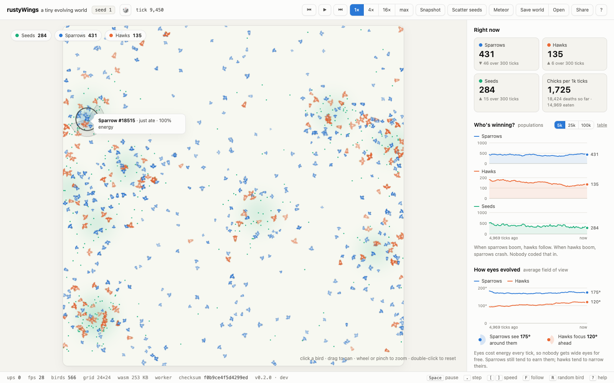
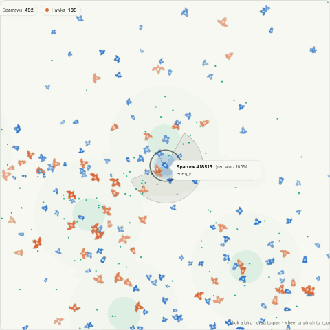
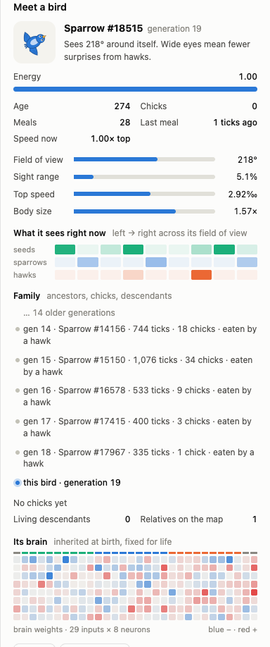

# rustyWings

**A tiny evolving world.** Sparrows eat seeds. Hawks eat sparrows. Nobody is
programmed to do anything: every bird's brain is inherited, mutated, and kept
only if it worked.

Live: **https://rusty-wings-iota.vercel.app**



rustyWings is an open-ended artificial-life simulation. Thousands of birds
share a wrapping world with seeds that regrow in drifting patches. Each bird
has an energy budget (moving, seeing and being alive all cost energy), a body
plan it can pass on (field of view, sight range, top speed, size) and a small
neural network that turns what its retina sees into steering. Birds with
enough energy have chicks; birds that run out die. There are no generations
and no fitness function. What you see is what survived.

The core is a Rust crate compiled both natively and to WebAssembly, and it is
deterministic to the bit: a seed means the same world on Linux, macOS,
Windows and in your browser. The checksum in the app's status bar is the same
number the command-line tool prints for the same seed and tick.

## In the browser



- Click any bird to meet it: energy, body plan, what its eyes see right now,
  the brain it was born with, and its family. Ancestors are listed back to a
  founder with how each one lived and died; living chicks are one click away;
  relatives get a halo on the map.
- Follow a bird and it leaves a trail. Show every bird's field of view to
  watch sparrows' eyes widen and hawks' narrow over generations.
- Save a world to a file and open it later, here or on the command line.
  Save a bird's genome and release it into another world.
- Share a link: the seed and settings replay the same world from tick 0.
- Meteors, seed scatters, live sliders, snapshots and rewind, a light and a
  dark theme, keyboard shortcuts, pinch to zoom.



## What is in the box

```
crates/rustywings-core   the simulation: no I/O, no threads, no platform math
crates/rustywings-cli    rustywings run | bench | verify | arena | sweep | config
crates/rustywings-wasm   the browser facade
web/                     Vite + TypeScript frontend: Web Worker, WebGL2, SVG charts
```

## Run it

Rust stable with the `wasm32-unknown-unknown` target (pinned by
`rust-toolchain.toml`), [wasm-pack](https://rustwasm.github.io/wasm-pack/),
Node 22+ and pnpm.

```bash
# the browser app
cd web && pnpm install && pnpm build:wasm && pnpm dev

# the same world, headless
cargo build --release -p rustywings-cli
./target/release/rustywings run --seed 1 --ticks 60000 --every 500 --out stats.csv
./target/release/rustywings verify --seed 1 --ticks 2000      # prints the checksum the app shows
./target/release/rustywings arena --seeds 3 --ticks 30000     # do evolved birds beat random ones?
./target/release/rustywings bench --agents 5000 --ticks 200

# continue a world saved from the browser, or check its checksum
./target/release/rustywings run --resume rustywings-1-t12000.world --ticks 100000 --snapshot later.world
./target/release/rustywings verify --resume rustywings-1-t12000.world --ticks 0

# try a grid of parameters across seeds, one summary row per run
./target/release/rustywings sweep --set plants.regrowth=6,12,24 --set predator.basal_cost=0.0008,0.0012 \
    --seeds 3 --ticks 60000 --out sweep.csv
```

The "Copy config" button in the app produces the JSON that `rustywings run
--config` reads, so a world tuned in the browser can be run for a million
ticks on the command line. `sweep` takes any dotted field of that JSON and
rejects a misspelt one instead of silently running the defaults.

## How it is checked

- `cargo test --workspace`: unit tests, a golden checksum for seed 1 at
  tick 2,000 (run on three operating systems in CI), and an ecology test
  that both species must survive 6,000 ticks without the rescue rule.
- `rustywings arena`: a standardised foraging arena scores a genome. CI
  fails if sparrows evolved for 30,000 ticks do not out-eat random ones.
- `web`: vitest loads the built wasm in Node and asserts the same golden
  checksum; ESLint (type-aware), Prettier and `tsc` gate the frontend.

## Credit

The idea of evolving neural-network birds with a retina of angular cells
comes from Patryk Wychowaniec's *Learning to Fly* series. The ecosystem,
the deterministic core, the tooling and the frontend here are original work.

MIT licensed, see [LICENSE.md](LICENSE.md).
